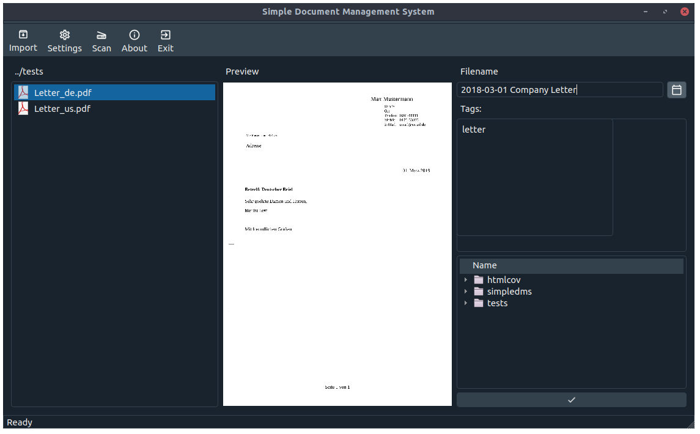
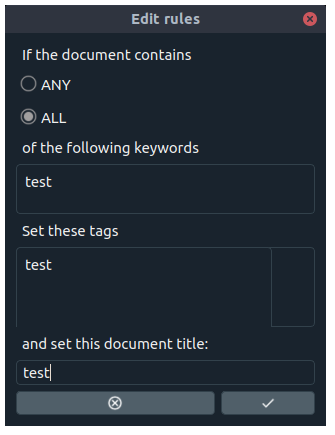

# Simple Document Management System

[](https://www.gnu.org/licenses/gpl-3.0)
<a href="https://github.com/ambv/black"></a>

----------
 

All started with my approach to switch to a paperless office at home. I was sick of sorting all the letters into a file cabinet which cost a lot of time. Furthermore, retrieving information is even more complicated.

Hence, I scanned all my documents with OCR so that I can search them easily. But then the question came up, how to manage the files. I did not want to have a complex document management system with a proprietary storage system. If the software company closes, all the information is lost. But I also did not want to sort everything manually. Then I found Hazel from Noodlesoft but unfortunately this was only for Mac. 

So with the requirements:
* simple
* no proprietary storage
* automatic rules
* works on Linux

the simple document management system was created. 

You define a monitorfolder which contains the unsorted and unnamed documents. You define rules which words in the document shall create a specific document title and keywords. The renaming and sorting into the corresponding directory is then done automatically with the file names always with the same pattern.

On Linux I use recoll from https://www.lesbonscomptes.com/recoll/ to search for documents content. This is a sophisticated tool and it makes no sense to develop an own solution for this purpose.





## Installation
It can be installed with
```
pip install simpledms
```

## Usage
Just run the main.py. Currently it requires pdftoppm for preview image generation.

## License
As this software uses PyQt5 it is licensed under GPLv3. 